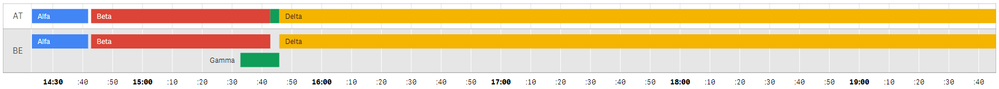

# [Qlik Sense](https://www.qlik.com/us/products/qlik-sense) Colored Timeline Extension Chart

##  Screenshots

Timeline with each bar on own line:

Timeline with grouped bars into one line based on first dimension:

## Usage

Dimensions:

- Dimension 1 (required): Main dimension and row label
- Dimension 2 (optional): Bar label
- Dimension 3 (required): Start datetime
- Dimension 4 (required): End datetime

Measures:
There is no measure.

##  Sources

- GitHub: https://github.com/plzaart/multicolored_timeline
- Qlik Branch: 
- Note please that this solution was created based on kai's project: https://github.com/kai/qlik-sense-timeline
